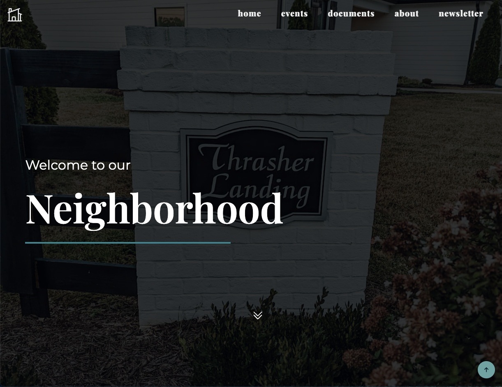
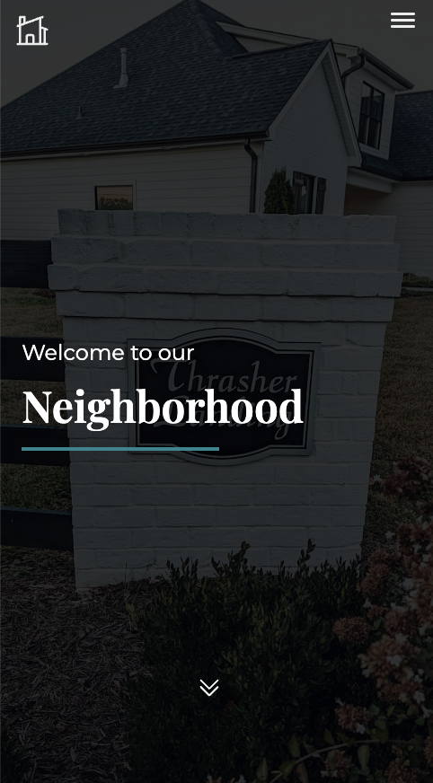

# Thrasher Landing Website

## Table of contents

- [Overview](#overview)
  - [The challenge](#the-challenge)
  - [Screenshot](#screenshot)
  - [Links](#links)
- [My process](#my-process)
  - [Built with](#built-with)
- [Author](#author)

## Overview

### The challenge

Users (a.k.a the residents of Thrasher Landing) requested:

- A simple site to house our neighborhood documents, any upcoming events, and a list of our board members
- Needed a responsive site that looked good on mobile as majority of the users accessed the site from their phones
- Needed it to be intuitive and user friendly for users of all ages

### Screenshot

### Links

- Live Site URL: [thrasherlanding.com](https://thrasherlanding.com)

## My process

### Built with

- Semantic HTML5 markup
- CSS custom properties
- Flexbox
- Mobile-first workflow
- JavaScript
- Animate.css

## Author

- Website - [RachelAndersonDooley](https://www.rachelandersondooley.com)
- Twitter - [@racheladooley](https://www.twitter.com/racheladooley)

